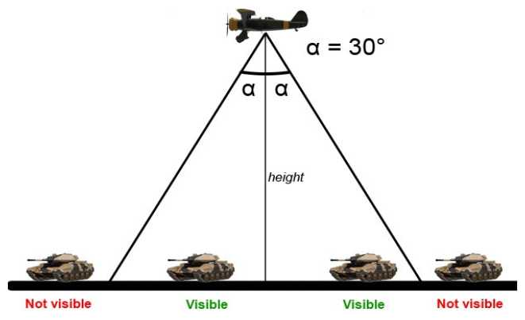

.. _mds-section:

MDS section
===========

.. note::

    `Russian version <https://github.com/IL2HorusTeam/il2fb-mission-parser/wiki/%D0%A1%D0%B5%D0%BA%D1%86%D0%B8%D1%8F-MDS>`_

:class:`~il2fb.parsers.mission.parsers.MDSParser` is responsible for parsing
``MDS`` section. It contains one key-value pair per each line. Section
describes Fog of War (FoW), AI and some other settings.

.. note::

    MDS FoW functions are only enabled if the difficulty option "No FoW Icons"
    is not selected. This is convenient way for server host to disable all FoW
    features without editing all mission files separately.

Section example::

    [MDS]
      MDS_Radar_SetRadarToAdvanceMode 1
      MDS_Radar_RefreshInterval 0
      MDS_Radar_DisableVectoring 0
      MDS_Radar_EnableTowerCommunications 1
      MDS_Radar_ShipsAsRadar 0
      MDS_Radar_ShipRadar_MaxRange 100
      MDS_Radar_ShipRadar_MinHeight 100
      MDS_Radar_ShipRadar_MaxHeight 5000
      MDS_Radar_ShipSmallRadar_MaxRange 25
      MDS_Radar_ShipSmallRadar_MinHeight 0
      MDS_Radar_ShipSmallRadar_MaxHeight 2000
      MDS_Radar_ScoutsAsRadar 0
      MDS_Radar_ScoutRadar_MaxRange 2
      MDS_Radar_ScoutRadar_DeltaHeight 1500
      MDS_Radar_ScoutGroundObjects_Alpha 5
      MDS_Radar_ScoutCompleteRecon 0
      MDS_Misc_DisableAIRadioChatter 0
      MDS_Misc_DespawnAIPlanesAfterLanding 1
      MDS_Radar_HideUnpopulatedAirstripsFromMinimap 0
      MDS_Misc_HidePlayersCountOnHomeBase 0
      MDS_Misc_BombsCat1_CratersVisibilityMultiplier 1.0
      MDS_Misc_BombsCat2_CratersVisibilityMultiplier 1.0
      MDS_Misc_BombsCat3_CratersVisibilityMultiplier 1.0

Output example:

.. code-block:: python

    {
        'radar': {
            'advanced_mode': True,
            'refresh_interval': 0,
            'ships': {
                'treat_as_radar': False,
                'big': {
                    'max_range': 100,
                    'min_height': 100,
                    'max_height': 5000,
                },
                'small': {
                    'max_range': 25,
                    'min_height': 0,
                    'max_height': 2000,
                },
            },
            'scouts': {
                'treat_as_radar': False,
                'max_range': 2,
                'max_height': 1500,
                'alpha': 5,
            },
        },
        'ai': {
            'no_radio_chatter': False,
            'hide_aircrafts_after_landing': True,
        },
        'homebase': {
            'tower_communications': True,
            'hide_unpopulated': False,
            'hide_players_count': False,
        },
        'crater_visibility_muptipliers': {
            'le_100kg': 1.0,
            'le_1000kg': 1.0,
            'gt_1000kg': 1.0,
        },
        'vectoring': True,
        'only_scounts_complete_recon_targets': False,
    }

**Description**:

.. contents::
    :local:
    :depth: 1

Radar
^^^^^

``MDS_Radar_SetRadarToAdvanceMode``
  Sets FoW to advanced mode: if this option is enabled, ALL FoW spotters on the
  map will show only those planes that are located inside assigned range &
  height limits. Range parameters are set for each home base object
  individually under home base ``Base FoW`` tab. If option is not set, player's
  side will see units' icons as long as it has at least one live radar.

  :Output path: ``radar.advance_mode``
  :Output type: :class:`bool`
  :Output value: ``True`` if ``1``, ``False`` otherwise

``MDS_Radar_RefreshInterval``
  Radar refresh period (in seconds): tells the game how fast positions of
  detected objects are refreshed. Works with or without advanced radar mode.

  :Output path: ``radar.refresh_interval``
  :Output type: :class:`int`
  :Output value: original value converted to integer number

``MDS_Radar_ShipsAsRadar``
  Treat ships as FoW spotters: makes ships spot enemy planes with their radars.
  Ships are divided into two groups. "Big Ships" that have powerful, long range
  radars and "Small Ships" that have less powerful, short range radars. If you
  want only big ships to act as FoW spotters, set ALL small ship settings to 0
  and vice versa.

  .. _ships-categories:

  .. note::

    "Big Ships" with powerful, long range radar
      All CVs (aircraft carriers), all battleships and all cruisers.

    "Small Ships" with less powerful, short range radar
      All destroyers.

  ..

  :Output path: ``radar.ships.treat_as_radar``
  :Output type: :class:`bool`
  :Output value: ``True`` if ``1``, ``False`` otherwise

``MDS_Radar_ShipRadar_MaxRange``
  Maximum range (in km) of detection of air targets by big ships.

  :Output path: ``radar.ships.big.max_range``
  :Output type: :class:`int`
  :Output value: original value converted to integer number

``MDS_Radar_ShipRadar_MinHeight``
  Minimum height (in meters) of detection of air targets by big ships.

  :Output path: ``radar.ships.big.min_height``
  :Output type: :class:`int`
  :Output value: original value converted to integer number

``MDS_Radar_ShipRadar_MaxHeight``
  Maximum height (in meters) of detection of air targets by big ships.

  :Output path: ``radar.ships.big.max_height``
  :Output type: :class:`int`
  :Output value: original value converted to integer number

``MDS_Radar_ShipSmallRadar_MaxRange``
  Maximum range (in km) of detection of air targets by small ships.

  :Output path: ``radar.ships.small.max_range``
  :Output type: :class:`int`
  :Output value: original value converted to integer number

``MDS_Radar_ShipSmallRadar_MinHeight``
  Minimum height (in meters) of detection of air targets by small ships.

  :Output path: ``radar.ships.small.min_height``
  :Output type: :class:`int`
  :Output value: original value converted to integer number

``MDS_Radar_ShipSmallRadar_MaxHeight``
  Maximum height (in meters) of detection of air targets by small ships.

  :Output path: ``radar.ships.small.max_height``
  :Output type: :class:`int`
  :Output value: original value converted to integer number

``MDS_Radar_ScoutsAsRadar``
  Recon planes are FoW spotters: this will enable selected recon planes to spot
  ground units. Only selected recon planes are able to identify ground units.

  :Output path: ``radar.scouts.treat_as_radar``
  :Output type: :class:`bool`
  :Output value: ``True`` if ``1``, ``False`` otherwise

``MDS_Radar_ScoutRadar_MaxRange``
  Maximum scan range: determines the range (in km) in which scouts can
  identify other aircrafts.

  :Output path: ``radar.scouts.max_range``
  :Output type: :class:`int`
  :Output value: original value converted to integer number

``MDS_Radar_ScoutRadar_DeltaHeight``
  Height limit of detection zone (in meters): defines the maximum altitude at
  which the reconnaissance aircraft can detect enemy ground targets.

  :Output path: ``radar.scouts.max_height``
  :Output type: :class:`int`
  :Output value: original value converted to integer number

``MDS_Radar_ScoutGroundObjects_Alpha``
  Angle (in degrees) of earth scanning: determines the angle at which
  reconnaissance aircraft can detect enemy ground targets.

  :Output path: ``radar.scouts.alpha``
  :Output type: :class:`int`
  :Output value: original value converted to integer number

  .. note::

    Scan delta height & scan alpha determine the range for which scouts can
    identify ground objects. The formula behind this is:

    .. math:: range = height * tan(alpha)

    So, the higher the scouts are, the more area they cover.

.. warning:: The more scout planes you assign, the slower your game might run!

AI
^^

``MDS_Misc_DisableAIRadioChatter``
  Disable radio messages sent by AI planes in dogfight.

  :Output path: ``ai.no_radio_chatter``
  :Output type: :class:`bool`
  :Output value: ``True`` if ``1``, ``False`` otherwise

``MDS_Misc_DespawnAIPlanesAfterLanding``
  Despawn AI aircrafts after they land and park: in dog fight mode when AI
  aircraft land and park, they will vanish from the map and release game
  resources. They will also not interfere with live players.

  :Output path: ``ai.hide_aircrafts_after_landing``
  :Output type: :class:`bool`
  :Output value: ``True`` if ``1``, ``False`` otherwise

Homebase
^^^^^^^^

``MDS_Radar_EnableTowerCommunications``
  Enables communications menu (tab key by default) for human players in
  dogfight.

  :Output path: ``homebase.tower_communications``
  :Output type: :class:`bool`
  :Output value: ``True`` if ``1``, ``False`` otherwise

``MDS_Radar_HideUnpopulatedAirstripsFromMinimap``
  Hide enemy and unused airfields from minimap.

  :Output path: ``homebase.hide_unpopulated``
  :Output type: :class:`bool`
  :Output value: ``True`` if ``1``, ``False`` otherwise

``MDS_Misc_HidePlayersCountOnHomeBase``
  This option, if enabled, will hide number of players that is displayed beside
  each home base object on your map on briefing screen.

  :Output path: ``homebase.hide_players_count``
  :Output type: :class:`bool`
  :Output value: ``True`` if ``1``, ``False`` otherwise

Craters
^^^^^^^

You can modify time before bomb/gun/rockets craters disappear. Default
multiplier is set to 1.0 (80 seconds) for all of them. By changing multipliers,
you can make craters visible for longer time. However this only works in single
player mission and coop missions. Setting long crater durations in dogfight
missions would cause inconsistency between players, since dogfight mode allows
joining anytime.

``MDS_Misc_BombsCat1_CratersVisibilityMultiplier``
  Multiplier for visibility time for craters caused by guns and rockets and
  bombs which weight is less then or equal 100 kg.

  :Output path: ``crater_visibility_muptipliers.le_100kg``
  :Output type: :class:`float`
  :Output value: original value converted to float number

``MDS_Misc_BombsCat2_CratersVisibilityMultiplier``
  Multiplier for visibility time for craters caused by torpedoes, TinyTim and
  bombs which weight is less then or equal 1000 kg.

  :Output path: ``crater_visibility_muptipliers.le_1000kg``
  :Output type: :class:`float`
  :Output value: original value converted to float number

``MDS_Misc_BombsCat3_CratersVisibilityMultiplier``
  Multiplier for visibility time for craters caused by bombs which weight
  is greater then 1000 kg.

  :Output path: ``crater_visibility_muptipliers.gt_100kg``
  :Output type: :class:`float`
  :Output value: original value converted to float number

Other
^^^^^

``MDS_Radar_DisableVectoring``
  Disables two vectoring commands from ground control orders menu:
  ``Vector to target`` and ``Vector to home``. This can simulate early war
  scenarios where own planes couldn't be tracked by means of radar,
  Y-Verfahren, etc. Works also in single player & coop missions.

  :Output path: ``vectoring``
  :Output type: :class:`bool`
  :Output value:
    inverted original value converted to integer number: ``True`` if ``0``,
    ``False`` otherwise

``MDS_Radar_ScoutCompleteRecon``
  Determines whether reconnaissance aircrafts are the only aircrafts allowed
  to complete recon targets.

  :Output path: ``only_scounts_complete_recon_targets``
  :Output type: :class:`bool`
  :Output value: ``True`` if ``1``, ``False`` otherwise
